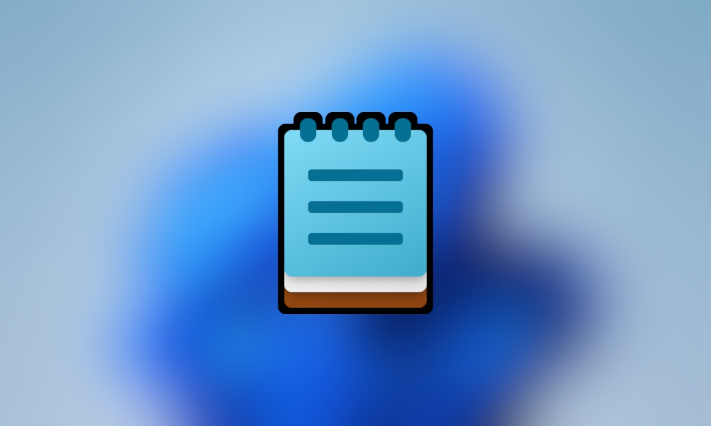

  
  <h1 align="center">Guia pessoal de estudos</h1>

## :dart: Guia pessoal de estudos

Esse roadmap é um guia de estudos particular utilizado de base para meus estudos
das seguintes linguagens de programação, bibliotecas, frameworks e banco de dados,
ambas as categorias possuem anotações de como estudar, documentações, cursos, e dica para
a maior assimilação de todo o conteúdo presente nesse roadmap.

 <strong>Siga nas redes sociais para acompanhar mais conteúdos: </strong>  

## 💡 Proposta desse guia

> A proposta deste guia é auxiliar com conteúdos para estudo e ferramentas para o meu estudo pessoal, sinta-se a vontade para tomar ele de base para os seus estudos caso você veja que existe alguma tecnologia em comum na nossa stack de linguagens ou frameworks, esse guia não tem como proposta guiar a todos por esse caminho, essa é um stack formada para estudos pessoais, porém você pode acompanhar outros guias como:

- [Guia de Cyber Security](https://github.com/arthurspk/guiadecybersecurity)
- [Guia Extenso de Programação](https://github.com/arthurspk/guiadevbrasil)
- [Guia do Desenvolvedor Front-end](https://github.com/arthurspk/guiadofrontend)
- [Guia do Desenvolvedor Back-end](https://github.com/arthurspk/guiadobackend)
- [Guia de Ferramentas e Extensões](https://github.com/arthurspk/guiadeferramentas)

## 📚 ÍNDICE

- [📃 Seções do Repositório](#-seções-do-repositório)  
- [📃 Documentação Técnica](#-documentação-técnica)  
- [☁️ Serviços de Nuvem](#%EF%B8%8F-serviços-de-nuvem)  
- [🔗 Pré-processadores](#-pré-processadores)  
- [📜 APIs & Arquitetura](#-apis--arquitetura)  
- [📦 Gerenciadores de Pacotes](#-gerenciadores-de-pacotes)  
- [🧪 Testes Unitários](#-testes-unitários)  
- [🎲 Banco de Dados](#-banco-de-dados)  
- [💾 Sistemas Operacionais](#-sistemas-operacionais)  
- [📚 Conteúdo Complementar](#-conteúdo-complementar)  
- [🧑🏻‍💻 Linguagens & Tecnologias](#-linguagens--tecnologias)  
- [🎨 Design & UX/UI](#-design--uxui)  
- [🛠️ Ferramentas & Extensões](#%EF%B8%8F-ferramentas--extensões)  
- [🗂️ Frameworks & Bibliotecas](#%EF%B8%8F-frameworks--bibliotecas)  
- [🕵🏻 Segurança da Informação](#-segurança-da-informação)  

## 📝 Anotações & Estudo

## 📃 Seções do Repositório

- [📃 Documentação Técnica](#)  
- [☁️ Serviços de Nuvem](#)  
- [🔗 Pré-processadores](#)  
- [📜 APIs & Arquitetura](#)  
- [📦 Gerenciadores de Pacotes](#)  
- [🧪 Testes Unitários](#)  
- [🎲 Banco de Dados](#)  
- [💾 Sistemas Operacionais](#)  
- [📚 Conteúdo Complementar](#)  
- [🧑🏻‍💻 Linguagens & Tecnologias](#)  
- [🎨 Design & UX/UI](#)  
- [🛠️ Ferramentas & Extensões](#)  
- [🗂️ Frameworks & Bibliotecas](#)  
- [🕵🏻 Segurança da Informação](#)  

## 📃 Documentação Técnica

> Seção de estudos que irá encaminhar você para aba de documentação técnica.

- [Mermaid.js](#)
- [Unified Modeling Language (UML)](#)
- [Smooth Documentation](#)
- [Docusaurus](#)

## ☁️ Serviços de Nuvem

> Seção de estudos que irá encaminhar você para aba de serviços de nuvem.

- [Amazon Web Services, Inc.](#)
- [Google Cloud Platform](#)
- [Microsoft Azure](#)

## 🔗 Pré-processadores

> Seção de estudos que irá encaminhar você para aba de serviços de nuvem.

- [SaSS](#)
- [Less](#)
- [Stylus](#)

## 📜 APIs & Arquitetura

> Seção de estudos que irá encaminhar você para aba de APIs e arquitetura.

- [API Rest](#)
- [API GraphQL](#)
- [API Soap](#)

## 📦 Gerenciadores de Pacotes

> Seção de estudos que irá encaminhar você para aba de gereciadores de pacotes.

- [NPM](#)
- [pNpm](#)
- [Yarn](#)
- [Webpack](#)

## 🧪 Testes Unitários

> Seção de estudos que irá encaminhar você para aba de testes unitários.

- [AVA](#)
- [Jest](#)
- [Mocha](#)
- [VItest](#)
- [Jasmine](#)
- [Cypress](#)
- [Puppeteer](#)

## 🎲 Banco de Dados

> Seção de estudos que irá encaminhar você para aba de banco de dados.

- [SQL](#)
- [MySQL](#)
- [MongoDB](#)
- [PostgreeSQL](#)
- [DynamoDB](#)

## 💾 Sistemas Operacionais

> Seção de estudos que irá encaminhar você para aba de sistemas operacionais.

- [Windows](#)
- [Windows Server](#)
- [Ubuntu](#)
- [Debian](#)
- [Kali Linux](#)
- [Parrot Security](#)
- [MacOS OS X](#)

## 📚 Conteúdo Complementar

> Seção de estudos que irá encaminhar você para aba de conteúdo complementar.

- [Algoritmos](#)
- [Redes de Computadores](#)
- [Arquitetura de Redes](#)
- [Lógica de Programação](#)
- [Estrutura de dados](#)
- [Protocos da Internet](#)
- [Expressões Regulares](#)

## 🧑🏻‍💻 Linguagens & Tecnologias

> Seção de estudos que irá encaminhar você para aba de linguagens e tecnologias.

- [C](#)
- [C#](#)
- [C++](#)
- [HTML](#)
- [CSS](#)
- [JavaScript](#)
- [TypeScript](#)
- [Python](#)
- [Golang](#)
- [Node.js](#)
- [Shell Script](#)
- [Assembly](#)
- [Swift](#)
- [Flutter](#)

## 🎨 Design & UX/UI

> Seção de estudos que irá encaminhar você para aba de design e ux/ui.

- [Figma](#)
- [Canva](#)
- [Adobe XD](#)
- [UI & UX Design](#)
- [Design Systems](#)
- [Adobe Premiere Pro](#)
- [Adobe Photoshop ES6](#)

## 🛠️ Ferramentas & Extensões

> Seção de estudos que irá encaminhar você para aba ferramentas e extensões.

- [Git](#)
- [Fig.io](#)
- [Github](#)
- [Terminal](#)
- [Docker](#)
- [Postman](#)
- [Insomnia](#)
- [Virtual Box](#)
- [Visual Studio Code](#)
- [VMWare Workstation Pro](#)

## 🗂️ Frameworks & Bibliotecas

> Seção de estudos que irá encaminhar você para aba frameworks e bibliotecas.

- [React](#)
- [Next](#)
- [Nest](#)
- [Vue](#)
- [Angular](#)
- [Bootstrap](#)
- [Wordpress](#)
- [Serverless](#)
- [Gatsby](#)
- [Express](#)
- [jQuery](#)
- [Redux](#)
- [Tailwind CSS](#)
- [Styled Components](#)
- [Material UI](#)
- [Charkra UI](#)
- [Mantine](#)
- [NextUI](#)
- [Daisy UI](#)
- [Windi CSS](#)
- [Uno CSS](#)
- [Stitches](#)
- [Vanilla Extract](#)
- [React Hook Form](#)
- [Zod](#)
- [HyGraph](#)
- [Prisma](#)

## 🕵🏻 Segurança da Informação

> Seção de estudos que irá encaminhar você para aba segurança da informação.

- [Crowsec EdTech](#)
- [Desec Security](#)
- [Solyd Offensive Security](#)
- [eLearnSecurity](#)
- [Offensive Pentesting](#)
- [Pentester Academy](#)
- [TCM Security](#)
